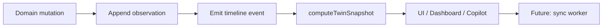

# Property Digital Twin — architektura (v1)

> **Stav:** `COMING_SOON` — typy, compute pravidla a integrační kontrakty.  
> **Implementace v kódu:** `src/lib/digital-twin/`

## Cíl

Každá **vlastněná** nebo **sledovaná** nemovitost může mít dlouhodobý digitální profil — jeden zdroj pravdy pro:

- portfolio dashboard (equity, LTV, cash flow agregace),
- AI Copilot (citovatelné fakty + timeline),
- refinance / tax / insurance remindery,
- budoucí Majetio sync (pouze s provenancí).

Digital Twin **nenahrazuje** Financial Passport (člověk) ani Smart Watchlist (trh). Doplňuje je per-nemovitostní vrstvou.

---

## Principy (neporušitelné)

| # | Pravidlo |
|---|----------|
| 1 | **Žádný automatický „aktuální odhad ceny“** bez `EstimatedValueObservation` |
| 2 | Každá hodnota v `valueHistory` musí mít: `source`, `method`, `confidence`, `observedAt`, `claimKind` |
| 3 | Computed metriky se **počítají při čtení** — neukládají se jako fakta |
| 4 | Chybí-li vstup → `null` + `blockers[]`, ne default z market-metrics |
| 5 | Timeline je **append-only** audit trail |
| 6 | `watched` → `owned` upgrade bez ztráty dat |

---

## Datový model

```
PropertyDigitalTwin
├── identity (id, label, relationship)
├── links (watchTargetId, majetioListingId)
├── location
├── purchase
├── financing
├── mortgageBalanceHistory[]
├── valueHistory[]          ← kritické: provenance
├── rentHistory[]
├── occupancy[]
├── expenses[]
├── repairs[]
├── renovations[]
├── documents[]
├── insurance[]
├── taxReminders[]
├── energy[]
├── propertyManager
├── keyDates[]
└── timeline[]
```

### Relationship

| Hodnota | Význam |
|---------|--------|
| `watched` | Jen Smart Watchlist — žádné vlastnické CF |
| `owned` | Portfolio / equity / refinance |
| `under_contract` | Rezervace / kupní smlouva |
| `sold` | Archiv — computed metriky read-only |

---

## Estimated value — politika

**Zakázáno:**

- Banner „aktuální tržní cena“ z `getMarketMetrics(city)`
- Backfill valueHistory z indexu bez partner feedu
- Majetio listing price jako „appraisal“ (jen `source: majetio_listing`, `method: listing_ask`, `confidence: low|medium`)

**Povolené zdroje (`ValueObservationSource`):**

- `user_entered`, `purchase_deed`, `bank_appraisal`, `majetio_listing`, `tax_assessment`, `cnb_index`, `partner_feed`

**UI povinnost:** zobrazit vždy `source · method · confidence · date` — nikdy jen číslo.

---

## Dynamicky počítané metriky

Funkce: `computeTwinSnapshot(twin, ctx)` v `compute.ts`

| Metrika | Vzorec / logika | Blokery |
|---------|-----------------|---------|
| **current equity** | `latestValue − latestMortgageBalance` | chybí value nebo balance |
| **estimated LTV** | `balance / latestValue` | stejné |
| **cash-on-cash** | `annualNetCF / equity` | chybí CF nebo equity |
| **annualized return** | TWR/IRR z historie | `COMING_SOON` — neinventovat |
| **rent growth YoY** | Δ rent 12m | &lt; 2 rent observations |
| **maintenance burden** | `(repairs+expenses YTD) / annualRent` | chybí nájem |
| **refinance opportunity** | Δ sazby vs trh + fixace | jen `owned`, chybí financing |

Každá metrika vrací `ComputedMetric`: `{ value, claimKind, formula, inputsUsed, blockers }`.

---

## Timeline (události)

| Event | Trigger |
|-------|---------|
| `purchased` | relationship → owned + purchase data |
| `renovated` | renovation project completed |
| `tenant_changed` | rent observation s novým tenantLabel |
| `rent_increased` | rent &gt; previous |
| `refinanced` | financing snapshot update |
| `value_estimated` | nová valueHistory observation |
| `occupancy_changed` | nové occupancy období |
| `relationship_changed` | watched → owned / sold |

Copilot cituje `timeline[].title` + `claimKind`.

---

## Pipeline



---

## Integrace (budoucí)

### Smart Watchlist

- `addPropertyWatch` → volitelně `bootstrapTwinFromWatchTarget`
- `recordPriceObservation` → **ne** automaticky do valueHistory (uživatel potvrdí → `value_estimated` event)

### Portfolio Dashboard

- Nový widget `portfolio_twin_detail` (owned twins only)
- `buildDashboardModel` rozšířit o `twinSnapshots[]` — agregace equity jen s validními observations

### AI Copilot

| Tool | Popis |
|------|-------|
| `twin.getSnapshot` | computed + blockers |
| `twin.listTimeline` | posledních N událostí |
| `twin.refinanceHint` | refinanceOpportunity |

Intenty: `twin_status`, `refinance_property`.

### Majetio

- `POST /api/bridge/majetio/twin-sync` — `COMING_SOON` (503)
- Inbound: `MajetioTwinObservation` → value/rent pouze s metadata

### Financial Passport

- Refinance context: `useCurrentRates` vs `twin.financing.ratePercent`
- Passport **nedodává** property value

---

## Storage

| Fáze | Mechanismus |
|------|-------------|
| v1 | `localStorage` key `hj-digital-twin-v1` |
| v2 | Server sync + account (SSO `COMING_SOON`) |

Max 25 twins, 120 value observations, 200 timeline events.

---

## Non-goals

- Scraping inzerátů pro auto-valuation
- Denní CMA bez licencovaného partnera
- Binární dokumenty v localStorage
- Jedno číslo „aktuální hodnota“ bez provenance
- Nahrazení Watchlist / Passport store

---

## Další kroky (po schválení architektury)

1. `storage.ts` + mutations (append observation, emit event)
2. UI `/digital-twin/[id]` nebo panel v `/sledovani`
3. Dashboard widget + Copilot tools
4. Majetio twin-sync endpoint (live)
5. CNB index partner feed (pokud legálně dostupný)
